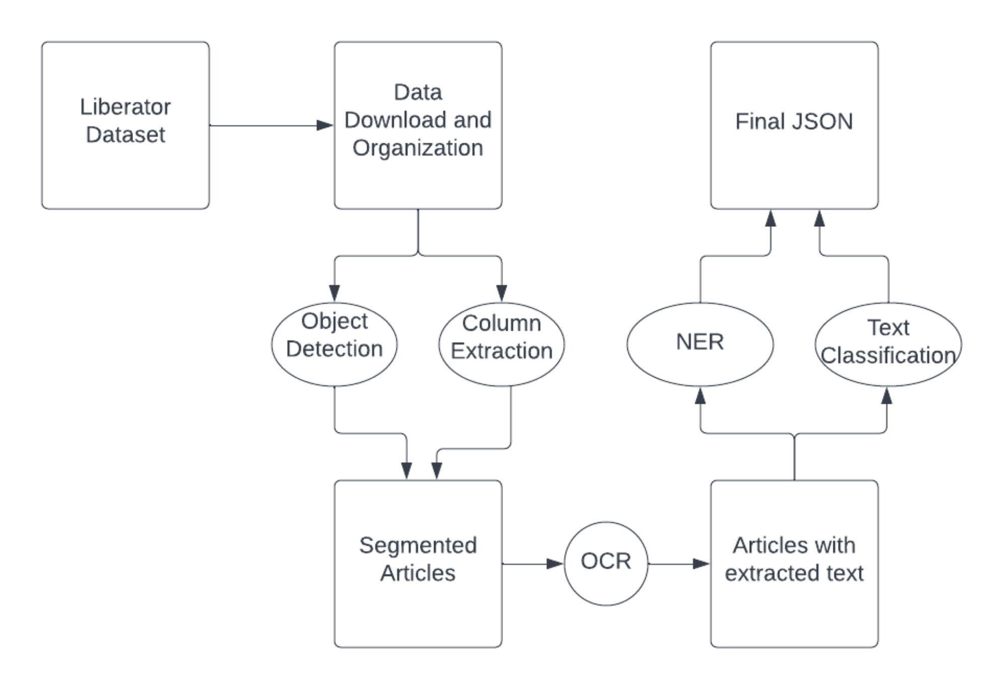

# CS501-BPL-Liberator

Repository containing code related to Boston University's Spark ML Practicum (CS 501 T2) collaboration with Boston Public Library.

# Introduction

## Project Overview and Goal

  *The Liberator* is a 19th-century abolitionist and womens' rights newspaper, founded and published by the abolitionist William Lloyd Garrison. The Boston Public Library's Digital Repository houses a full scanned archive of the newspaper, and this project's goal is to digitize and digest the articles and their text. Existing optical character recognition (OCR) models would interpret a newspaper page as one piece of text and attempt to read it from the left edge to the right edge before wrapping around again. This would produce nonsensical output for our input data. To leverage existing OCR solutions, we implement a multi-stage pipeline, consisting of article segmentation, OCR of text, and named entity recognition (NER) of the extracted article-level text.
  
  ## Why Machine Learning?
  
  This project and its requirements naturally lend themselves to the advantages of a machine learning approach. OCR and NER tools have been widely improved by machine learning approaches, and there exist vast libraries and toolkits to aid in the simple out-of-the-box development of custom OCR/NER pipelines, some of which will be discussed here. Further, the problem of intelligent and accurate article segmentation necessitates the use of machine learning, specifically that of neural networks. In our problem, as is commonly the case with historic newspaper digitization work, The Liberator dataset is not a perfectly-scanned digitization. Many misaligned scans, damaged papers, and blemished pages throw off any direct segmentation approach. Furthermore, over the 30+ year run of The Liberator, the paper underwent constant design and layout changes, making intelligent article extraction a necessity.

## Birds-Eye-View of Pipeline

# Getting Started

## How it Works

The entire pipeline looks for input images in either a directory provided as an argument, or by looking inside of data/input_images if no argument is provided. By simply running main.py without arguments, the entire pipeline will be ran on the provided test files inside of input_images. This is a convenient way to familiarize oneself with the function of the app and also for grading. Otherwise, a full absolute path to a image directory that follows the provided directory organization scheme is also doable.

## Dependencies
All Python dependendicies for this pipeline are handled with the Pipfile. Usage of the Pipfile and pipenv is explained in more detail below.

More pertinently, there are a few packages and files that will need to be manually downloaded and placed in order to run the full pipeline.

1. bbz-segment/05_predicition/**data/models** - Inside of the subdirectory bbz-segment/05_prediction, it is required to create the subdirectory **data/** and place the models folder containing the pre-trained ML models for article segmentation. This pre-trained TensorFlow model is available [here on Dropbox](https://www.dropbox.com/sh/7tph1tzscw3cb8r/AAA9WxhqoKJu9jLfVU5GqgkFa?dl=0), by the original authors. Please note, that in this directory, you will find two folders: *blkx* and *sep*. The *sep* models are the only ones utilized for this project, so for your own memory considerations, it may be preferable to only download this folder, ensuring in the end that the parent directories are all in the same order (data/models/v3/sep/).

2. ner/**stanza_resources** - The NER portion of the pipeline uses Stanza, an NLP package by the Stanford NLP Group. stanza-resources/ contains the language processors required to process and tag entities in text. The folder can be found [here on Google Drive](https://drive.google.com/drive/folders/1Le0sxSRzmzdCAIeZRRKjs9mjaD-VCmcd?usp=sharing) and should be placed inside of the directory ner/.

3. **config/credentials.json** - For the OCR, we utilize Google Cloud Vision. Accessing the Google CV API requires setting up a service account and setting the proper environment variable to point to your credentials.json file, containing the API Key information. Our pipeline automatically checks and sets the appropriate environment variable to point to a credentials.json file inside of a **config** directory. All that needs to be done is to create a config/ directory in the main project directory and place the Google CV credentials.json (with that same filename) inside of it. Detailed steps to create a service account and download a credentials.json with your API Key can be found here: https://cloud.google.com/docs/authentication/getting-started#creating_a_service_account.

Without a credentials.json, the pipeline will still run up to article segmentation, and then announce that it is quitting the rest of the pipeline.

## Run the Pipeline!

This section shares step-by-step instructions on running the pipeline.

Get the repo with `git clone https://github.com/SikandAlex/CS501-BPL-Liberator.git`

Next, using the information under the **Dependencies** section, ensure each of the necessary packages are properly placed.

Then, install Python dependencies. Use `pip3 install pipenv` to get pipenv first, then, from __inside of the project root directory__:
1. `pipenv install`
2. `pipenv shell`

Now you should have all of the dependencies installed.

Finally, you are ready to run. To run with the provided test files inside of data/input_images/, just run with `python main.py`. To run on another directory,
run with `python main.py -i <absolute path to input directory>`. The input directory you are providing must follow the same issue organization and naming schema
as data/input_images/. Please read the Notes below before a full run.

## Notes

__Please note__, Google Cloud Vision API requests are charged above 1000 units of text detection. For the given test files of 3 full issues, the requests to CV will be *far* below the 1000 unit threshold (40-80 articles are detected per full issue). In case you decide to run on more test files or multiple times, ensure that you are aware of the [costs and quotas.](https://cloud.google.com/vision/pricing#google_cloud_platform_costs)

Note that this pipeline is heavy in computing power and time. Running the three-issue test set through the entire pipeline on a 2015 Macbook Pro, Intel i5 2.7 GHz processor took about ~15 minutes and a lot of whirring. For grading or testing purposes, it would be okay to remove some data from input_images/, ensuring that the directory organization is still consistent.

If running on the SCC, I've found that the best method is to request a Desktop node from interactive apps rather than running directly on a terminal in SCC. Due to the way user paths/environment variables are set in the SCC, running pipenv in the terminal may be problematic.

The TensorFlow version needed to run the pre-trained model is an older one (1.15), but this is handled by the Pipfile. Nonetheless, there are some warning messages that may appear during a full run of the pipeline. The model is still able to run fully despite these terminal messages.

## Data Downloader/Input Format

Inside of utils, there is a data_downloader.py and a data_organization.py file. These are the scripts used on BU's Shared Computing Cluster to download and organize The Liberator dataset for our use. While they are tailored to run on the SCC, one can edit and use these to download or save part of the dataset (the full dataset is considerably large!).

Under the SCC class directory, under /liberator_team/liberator_data/, is the full dataset for The Liberator. One can download or copy these folders for custom testing.

# Detailed Breakdown of Pipeline

The actual pipeline processes the input in four major stages: column extraction & object detection, article segmentation, OCR & NER, and final output consolidation.

## Column Extraction and Object Detection

In order to segment articles out of the newspaper, a machine will need guiding entities that can signal the bounding boxes of article text. In many historic newspapers, just as in The Liberator, these come in the form of vertical dividing lines creating columns, and smaller, thin horizontal lines separating the ends and starts of different articles.

Detecting these bounding lines was done using two processing methods. First we considered, and in the end deployed, an object detection neural network that could recognize and label objects on a page image such as horizontal separators and vertical separators. This task was done by applying the trained model from a similar research task, [found here](https://arxiv.org/abs/2004.07317), with the corresponding GitHub repo [here](https://github.com/poke1024/bbz-segment). 

"bbz-segment", as the repo and project are called, was built for the exact same problem statement as ours: article segmentation on a historical newspaper, this one being a German paper named Berliner B¨orsen-Zeitung (BBZ). The difference in this task, however, is that BBZ is made with a much more complex article layout structure than what is seen anywhere on The Liberator. Still, the task of detecting article separators and other objects on the page remains the same.

The bbz-segment problem was done with models built for two purposes, *blkxk* models were built to detect and extract larger objects such as text regions, background, tables, and images on a page. The *sep* models, which were ulitmately the models adapted to this project, aimed to detect separator objects, primarily dividing lines, on the pixel-level.

The *sep* models to detect these separating objects were built using transfer learning on the [EfficientNet](https://ai.googleblog.com/2019/05/efficientnet-improving-accuracy-and.html) architecture with pre-trained weights on the ImageNet dataset and fine-tuned with manually labeled pages of BBZ. We found that applying the *sep* models directly onto The Liberator gave usable results in the article segmentation phase.

The other segmentation approach we attempted was not a neural network, but rather, a method of layered image augmentations to detect and extract regions of text. Primarily, we implemented a column extractor using the knowledge of empty spacing between columns of text. Using the approach from [this repo](https://github.com/jscancella/NYTribuneOCRExperiments) which did the same on historic NYCTribune newspaper pages, we were able to get a column extractor working quite well on our Liberator dataset. The idea was to use this column separator information in conjunction with some method to find the horizontal separators within columns, likely with a similar object detection model. In the end, the amalgation of this column separator information with bbz-segment was problematic, so the column extractor is still ran in the pipeline but is currently a vestigial product. We anticpate that future teams can use this column extraction approach as an intermediate stage for better segmentation and OCR.

## Article Segmentation

Adapting the work from last semester's team on BPL's The Liberator, the actual article segmentation of the pages was done by using the object information detected from the bbz-segment models and calculating the appropriate bounding boxes for articles. 

In building upon this work, our primary addition was the use of filters throughout the pipeline to delete false positive segmentations. Often, the bbz-segment method would result in many "articles" which were in fact not articles at all, but often section headers or seemingly random blank space. First, logical filtering was done by removing any segments that were too small (<200px) or oddly-shaped (e.g., spanning half of the page horizontally).

More creatively, we used the next stage in the pipeline, the OCR, to make inferences about the validity of an article segmentation. Due to the effectiveness of Google CV's OCR and the high quality of our dataset, we believe it was a safe hypothesis that any time no text (or extremely little text) was extracted from an article image, it signaled a false positive. We filtered out these articles in the OCR stage before they were added to the final output.

## OCR & NER

After article segmentation, the pipeline runs a cropping script upon all of the articles and puts the cropped images through Google Cloud Vision's API for OCR. This OCR engine is already proven to be very effective, and on a high-quality dataset like The Liberator, extracting text was shown to be a cakewalk for Google CV. There are small hiccups primarily due to the old language used in the newspaper, and a post-processing spell corrector was considered and attempted on our pipeline. Another possible OCR engine considered was Google Tesseract, an open-source and free alternative to Google CV.

The extracted text from the OCR portion is put through Stanford CoreNLP's Stanza package, an NLP package for entity recognition. Out of the box, this package is very simple to use, effective, and free as well. We've found excellent results in Stanza and with its ease-of-use, ultimately chose this package for our NER requirements. Another package considered was spaCy entity recognizer, and spaCy was again used for the attempted spell-correction portion of the pipeline.

## JSON Output

The final output of the entire pipeline is a JSON output full of the entire input dataset's processing. The output JSON encodes article information, including file/page location, location coordinates, OCR text, title, and named entities. 

The final presentation of this project for Spark! gave a detailed breakdown of the JSON output and its analogy to the actual Liberator pages. The presentation is available [here on Google Slides](https://docs.google.com/presentation/d/1ic3R6HgVVC_7Ymgjw_hyrITFRV563MjEC8D31PpCte4/edit?usp=sharing).

# Further Work

The primary area of improvement is in the article segmentation accuracy. Indeed, we believe the accuracy and effectiveness of article segmentation can be greatly improved by finetuning the given sep models from bbz-segment with Liberator data, or, transfer learning on the EfficientNet architecture directly just as in bbz-segment. According to the research in bbz-segment's approach, 40 fully-labeled newspaper pages are enough to obtain a reasonably accurate object detection model for a given usecase.

The stages of our pipeline are built in linear fashion, where an entire stage must be complete for all inputs before the next stage can begin. This is slow and inefficient even on the SCC. It would be a worthwhile effort to multithread many of the processes inside of the article segmentation portion of the pipeline, and the main stages of the pipeline themselves.

We have some starter code on running a spell-correcter library after the OCR, which would clean up any OCR errors. It may be a valuable addition to the pipeline.

# References and Attributions

Liebl, B., & Burghardt, M. (2020). An Evaluation of DNN Architectures for Page Segmentation of Historical Newspapers. https://arxiv.org/abs/2004.07317v1

Peng Qi, Yuhao Zhang, Yuhui Zhang, Jason Bolton and Christopher D. Manning. 2020. Stanza: A Python Natural Language Processing Toolkit for Many Human Languages. In Association for Computational Linguistics (ACL) System Demonstrations. 2020. [pdf][bib]

https://medium.com/@blacksmithforlife/better-ocr-for-newspapers-c7c1e2788b7a

https://github.com/weirdindiankid/CS501-Liberator-Project

Many thanks to the Fall '20 Liberator team and https://github.com/IanSaucy for their start and advice on this project, and also to the BU Spark! faculty and staff.

  
 

