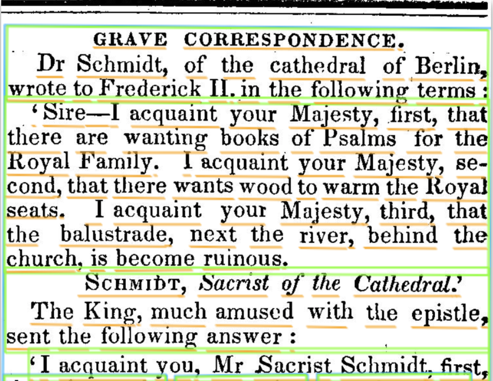
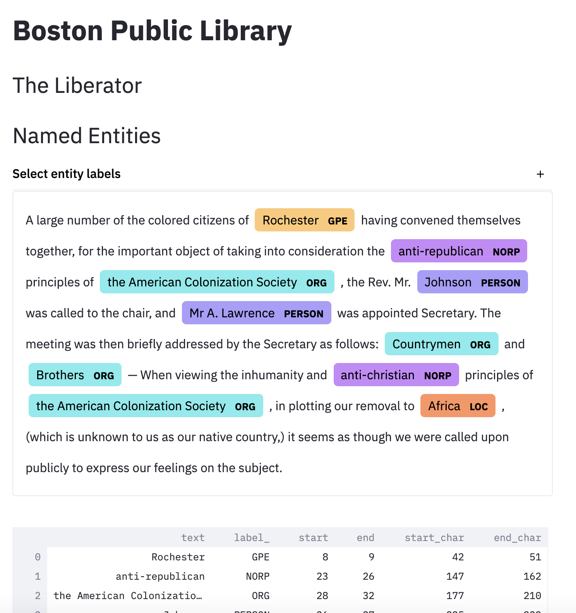
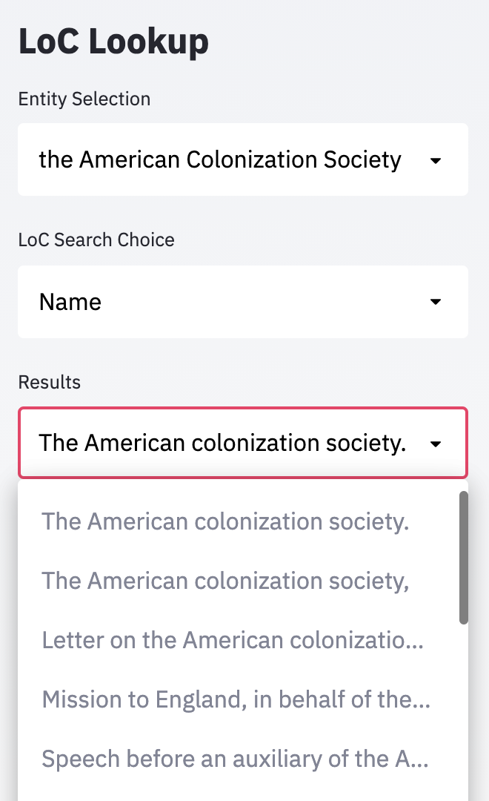

# CS501-BPL-Liberator
Repository containing code related to Boston University's Spark ML Practicum (CS 501 T2) collaboration with Boston Public Library.

  

# Downloading Data
Download data using the ```./utils/download-liberator.py``` and the included CSV file 

Currently this downloads ALL of the data, which may quickly eliminate all your free space (needs editing).

# Pipeline Overview 
Full pipleline demonstration in [PipelineExample.ipynb](https://github.com/SikandAlex/CS501-BPL-Liberator/blob/main/ocr/PipelineExample.ipynb)

## Column Detection (Using Frequency Information)
Pipeline capable of [detecting columns](https://github.com/jscancella/NYTribuneOCRExperiments/blob/master/findText_usingSums.py) from newspaper scans without using any ML (pattern matching / pattern exploitation instead)


## OCR (Optical Character Recognition) 
Google Cloud Vision - [Document Text Detection](https://cloud.google.com/vision/docs/ocr)



## Spell Correction
[autocorrect](https://github.com/fsondej/autocorrect) Python library

## Extracting Articles from Column Level OCR
TO DO, PHASE 1

## OOTB NER
If you are using laptop (NO GPU) use ```space.load('en_core_web_sm')``` 
If you are using a GPU use ```space.load('en_core_web_trf')``` (new, much higher accuracy, transformer based)

# Object Detection 
Proposed faster-rcnn model to extract article start/stop markers from the newspaper
[faster-rcnn implementation](https://colab.research.google.com/github/a8252525/detectron2_example_PCBdata/blob/master/PCBdata_fasterRCNN_colab.ipynb#scrollTo=WyR8yIqPFcNn)

## Labeling Data for Object Detection (not completed)
1) Label the data with bounding boxes using [Label Studio](labelstud.io)
2) Export in COCO format 

# Prototype NER (Named Entity Detection) LoC Entity Labeling Tool 

### Starting the web-app
streamlit run ```./ner/app.py```

Assuming that we need to know more than just the type of entity, we also need to assign the entity to a Library of Congress identifier. For this purpose, we have created a basic web application using [Streamlit](streamlit.io). 



The sample text is hard-coded for now but you can select one of the recognized entities in the sidebar and attempt to retrieve the top search results from the Loc API. 

To Do: It needs to be better and more tightly integrated with the LoC API. In addition, currently, when fetching data, the UI hangs because it's not being done asynchronously or something so that needs to be handled. We also need a submit button and a way to somehow save the labels to a data structure or file. 



